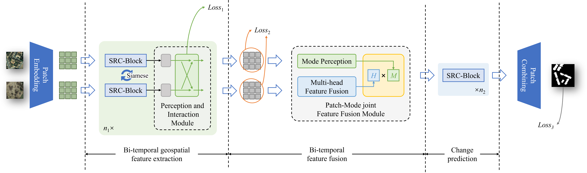

# SRC-Net: Bi-Temporal Spatial Relationship Concerned Network for Change Detection


[](https://paperswithcode.com/sota/building-change-detection-for-remote-sensing?p=src-net-bi-temporal-spatial-relationship)

[](https://paperswithcode.com/sota/building-change-detection-for-remote-sensing-1?p=src-net-bi-temporal-spatial-relationship)



## Introduction

Change detection (CD) in remote sensing imagery is a crucial task with applications in environmental monitoring, urban development, and disaster management. CD involves utilizing bi-temporal images to identify changes over time. The bi-temporal spatial relationships between features at the same location at different times play a key role in this process. However, existing change detection networks often do not fully leverage these spatial relationships during bi-temporal feature extraction and fusion. In this work, we propose SRC-Net: a bi-temporal spatial relationship concerned network for CD. The proposed SRC-Net includes a Perception and Interaction Module that incorporates spatial relationships and establishes a cross-branch perception mechanism to enhance the precision and robustness of feature extraction. Additionally, a Patch-Mode joint Feature Fusion Module is introduced to address information loss in current methods. It considers different change modes and concerns about spatial relationships, resulting in more expressive fusion features. Furthermore, we construct a novel network using these two relationship concerned modules and conducted experiments on the LEVIR-CD and WHU Building datasets. The experimental results demonstrate that our network outperforms state-of-the-art (SOTA) methods while maintaining a modest parameter count. We believe our approach sets a new paradigm for change detection and will inspire further advancements in the field.

## Code

The pytorch implementation for SRC-Net.

```python
from SRCNet import SRCNet
net = SRCNet().to(device)
```

### Train

```python
python train.py
```

<!-- ### Well-trained model

```python
# For CDD dataset
net.load_state_dict(torch.load("RDPNet_CDD.pth"))
``` -->


## Paper

This work has already been published on [IEEE Journal of Selected Topics in Applied Earth Observations and Remote Sensing (JSTARS)](https://ieeexplore.ieee.org/xpl/RecentIssue.jsp?punumber=4609443).

The paper is now available on [JSTARS](https://ieeexplore.ieee.org/document/10552311) and [arXiv](https://arxiv.org/abs/2406.05668).

### Citation

If you find this work valuable or use our code in your own research, please consider citing us with the following bibtex:

```bibtex
@article{chen2024srcnet,
    author={Chen, Hongjia and Xu, Xin and Pu, Fangling},
    journal={IEEE Journal of Selected Topics in Applied Earth Observations and Remote Sensing}, 
    title={SRC-Net: Bi-Temporal Spatial Relationship Concerned Network for Change Detection}, 
    year={2024},
    pages={1-13},
    doi={10.1109/JSTARS.2024.3411622}
}
```

## Dataset

### LEVIR-CD

Paper: [A Spatial-Temporal Attention-Based Method and a New Dataset for Remote Sensing Image Change Detection](https://www.mdpi.com/2072-4292/12/10/1662)

[Link](https://justchenhao.github.io/LEVIR/)

### WHU Building

Paper: [Fully Convolutional Networks for Multi-Source Building Extraction from An Open Aerial and Satellite Imagery Dataset](https://ieeexplore.ieee.org/abstract/document/8444434)

[Link](https://study.rsgis.whu.edu.cn/pages/download/building_dataset.html)


## Our Related Work

RDP-Net: Region Detail Preserving Network for Change Detection | [Paper](https://ieeexplore.ieee.org/document/9970750) | [Code](https://github.com/Chnja/RDPNet)

## Contact

Chen Hongjia: chj1997@whu.edu.cn